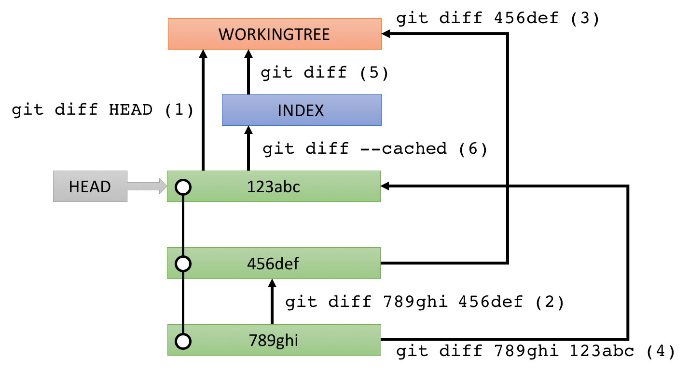

# Overview

The Git plugin allows you to manage versions of local Kettle files without leaving Spoon.

# How to install

```
$ cd data-integration/plugins
$ unzip pdi-git-plugin-X.X.X-jar-with-dependencies.zip
```

To uninstall, just remove the `pdi-git-plugin` folder.

# How to use

The Git plugin is provided as a <i>perspective</i> (See [Using Perspectives](https://help.pentaho.com/Documentation/7.1/0L0/0Y0/020)).
**View > Perspectives > Git** takes you to the Git perspective.

## Git Repository

When you switch to the Git perspective, you will be asked to choose a Git repository out of a list to open.
To add a Git repository to the list, go to

**Git Repository > Add**.

The information of repositories will be stored in `$HOME/.pentaho/metastore/pentaho/Git Repository/`.

### Config

 **Config** allows you to configure the opened Git repository.
Currently, a remote repository named "origin" can be set.

## Working with files

Stage changed files by checking the checkbox on the left side of each file, write a good commit message, change the author name if necessary, and finally <b>Commit</b>.
Right-click on a commit pops up a context menu, where you can choose **checkout** to checkout that particular commit.

## Diff

Diff information can be obtained texually and visually.
In order to get the right diff you want to see, it is important to understand the followings:

- When only one commit is selected, the diff will be between the selected commit and its first parent commit.
- When multiple commits are selected, the diff will be between the newest commit and the oldest commit (out of the selected commits).
- When no commit is selected, it is assumed that WORKINGTREE is selected.

Examples:

- Only WORKINGTREE is selected: (1)
- Only 456def is selected: (2)
- WORKINGTREE and 456def are selected: (3)
- 123abc and 789ghi are selected: (4)

You can also see the diff of a specific changed file by selecting one of them, but special rules applie when WORKINGTREE is selected.

- If only WORKINGTREE is selected AND the selected file is not staged: (5)
- If only WORKINGTREE is selected AND the selected file is staged: (6)
- If another commit is also selected: the diff will be between WORKINGTREE and that another commit



A texual diff will be displayed in the bottom left corner.
Visual diff can be displayed by right-clicking on a changed file, then choose **Visual diff**.
This opens up two tabs in the Data Integration perspective:
one tab shows the difference you see when looking from one commit to another commit, and the other tab shows the other way around.

The difference is represented by the small icon superimposed on the top-right corner on the steps/job entries.
Each icon means as follows:

- : Added
- : Changed
- : Removed

Note that even just a x-y location change of step/job entry is recognized as a changed one.

## Remote

 **Pull** and  **Push** allows you to sync between the opened, local repository and the remote one.
**Pull** and **Push** are equivalent of `git pull` and `git push`, respectively.
Thus, the remote `origin` is the source of <b>Pull</b> and the target of <b>Push</b> unless configured otherwise.
If an error (e.g., merge conflict) happens, the operation will be just cancelled.

These commands, however, behave differently depending on how `origin` and branches are configured.
Here is an example `.git/config` (see [here](https://git-scm.com/docs/git-config) for more details):

```
[branch "master"]
  mergeoptions = --no-ff
[remote "origin"]
  url = git@example.com:hiromu/testrepo.git
  fetch = +refs/heads/*:refs/remotes/origin/*
  pushurl = git@example.com:hiromu/testrepo.git
  pushurl = git@example.com:hiromu/testrepo2.git
```

With this example config, **Pull** uses the non fast-forward mode instead of the default fast-forward mode when merging into `master`, **Push** pushes the current branch to two remotes.

## Branches

 **Branch** has branch operations: **Checkout** switches between branches, **Create / Delete** can create / delete a branch, **Merge** can merge a branch into the current one.

Switching to a remote branch, say `origin/feature`, gets you in a detached HEAD state.
Use **Branch > Create** to create a local branch, say `feature`, then you will get out of the state.
Collectively, they are equivalent of `git checkout origin/feature` then `git checkout -b feature`.

## FAQ

### When pushing, I get an "UnknownHostKey" error

This happens when connecting to the remote repository via SSH.
Please add the host to `~/.ssh/known_hosts` in "ssh-rsa" format instead of "ecdsa-sha2-nistp256" format.

### The remote host has been added, but I still get an "UnknownHostKey" error

This could happen for example when the remote host is Gerrit.
The remote host will be added by executing `$ ssh -p 29418 hiromu@localhost`

```
[localhost]:29418 ecdsa-sha2-nistp256 AAAAE2VjZHNhLXNoYTItbmlzdHAyNTYAAAAIbmlzdHAyNTYAAABBBAFgEc3BqPijHvVs5KoXLLoBaYtBlW8c8v+wpHEPpKObAF0lSG2qt764zFUE1eRlb/thq8RdNxHQ8l+i4VLTlR8=
```

However, JSch (Java library for SSH and used in the Git plugin) prefers **ssh-rsa** over **ecdsa-sha2-nistp256**. Hence, add the remote host like below.

```
[localhost]:29418 ssh-rsa AAAAB3NzaC1yc2EAAAADAQABAAABAQDVoiADWyjer2MRMZYAl1Ws/0zj9VyqMgYQxgNL+xcFGz4cO4AZIaL5L6TlNaU5bOF3WeCFgDLMrMioUoWS/0yLE5Q9mXwE2/5V3fEKDgMfuO+xvEGoh/xZb0GqhCeioG63+clqrXM8DvYfqzMmUg8ksPejEYeQpSrTkg0S5RE9AEB/+qvNnipye7M+9Nutr2lSE+GRhRfFNITCXLIAN6ukoKis+xVZgCMXFSnS41PlhQ/mLNJdA1bMxjm1/58iJsdF44iD+cuM/mFvLoAnXeAbOkkj8jyM136vAvO45M5c+a6Z8k4X7Q/CxsZ2IowWfUshg0jsjerzANUPCaoP9VJX
```

### When behind proxy

Define *System Properties* (not environment variables) like below in spoon.sh

```
OPT="$OPT -Dhttp.proxyHost=localhost -Dhttp.proxyPort=3128 -Dhttps.proxyHost=localhost -Dhttps.proxyPort=3128"
```

or in Spoon.bat

```
set OPT=%OPT% "-Dhttp.proxyHost=10.0.2.2" "-Dhttp.proxyPort=3128" "-Dhttps.proxyHost=10.0.2.2" "-Dhttps.proxyPort=3128"
```

The host and port should be replaced according to your proxy server.

### I got "407 Proxy Authentication Required" error

Proxy Authentication is currently not supported.

### When I checkedout a remote branch, say *origin/develop*, I ended up being in a HEAD detached state. How can I create a local branch?

Please create a branch called *develop*, then you will be out of the HEAD detached state.

### How can I revert to one of the commits?

*Revert* (equivalent to `git revert`) has not been and will not be implemented in this plugin because reverting to a commit may conflict and it is not easy to resolve conflicts of Kettle files.
However, you can still let a Kettle file revert to a past commit: open the interested Kettle file of the particular commit (Context menu > Open), change the Transformation/Job name if you want, save it, stage it, and make a new commit.

# How to compile

```
mvn clean package
```
